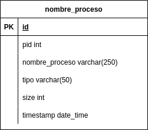
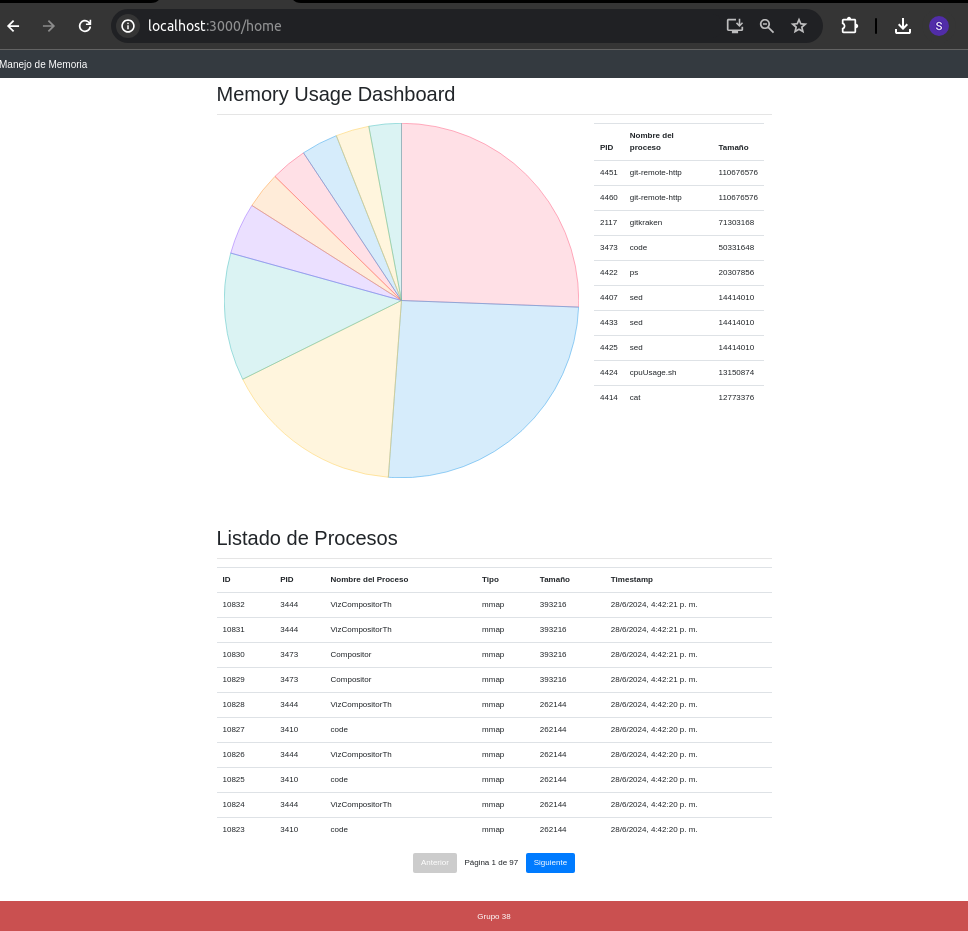

# SO2_GRUPO38
Sergio Zapeta
200715274

# Instalaciones

## System Tap
```
sudo apt-get install systemtap systemtap-runtime
```

# MySQL
```
sudo apt-get update
sudo apt-get upgrade
sudo apt-get install libmysqlclient-dev
```

# Node
```
sudo apt install curl
curl -sL https://deb.nodesource.com/setup_14.x | sudo -E bash -
sudo apt-get install -y nodejs
```

# Compilacion

## Archivo lector en C
```
gcc -o lector lector.c -lmysqlclient
```

## Archivo monitor en SystemTap
```
sudo stap monitor.stp | ./lector
```

# Explicacion 

## Monitor.stp

SystemTap es un sistema para la observación y depuración dinámica en sistemas Linux. 

Este script se usa para monitorear llamadas al sistema relacionadas con mmap y munma, estas funciones son utilizadas para asignar y desasignar memoria en el espacio de direcciones de un proceso en Linux.

Este escript escrbira en la consola el nombre del proceso, el id del proceso, la fecha en que se esta originando la llamada, el tamaño de la llamada y es tipo de llamada realizada.

## Lector.c
Este es un programa en C que se encarga de leer la salida del script monitor.stp y guardarla en una base de datos MySQL.

Las credenciales de la base de datos se encuentran en un archivo .env con las siguientes variables:
```
DB_HOST=192.168.XX.XX
DB_USER=nombre_usuario
DB_PASS=pass_usuario_mysql
DB_NAME=nombre_base_datos
DB_PORT=3306
```

## Base de Datos
En esta tabla se guardaran los datos obtenidos del script monitor.stp y que fueron leidos por el programa en C.

### Modelo Entidad Relacion



### Script de creacion de la base de datos
```

CREATE DATABASE IF NOT EXISTS `memoriadb`;

use memoriadb;

create table memoria_proceso(
	id INT AUTO_INCREMENT PRIMARY KEY,
    pid VARCHAR(16),
    nombre_proceso VARCHAR(256),
    tipo VARCHAR(16),
    size BIGINT,
    timestamp DATETIME
);

```

En esta tabla se guardaran los datos obtenidos del script monitor.stp y que fueron leidos por el programa en C.

# API
Esta es un API REST hecha en NodeJs que se encarga de compartir los datos de la base de datos en formato JSON.

Esta api, expone un endpoint que devuelve todos los registros de la tabla memoria_proceso.
```
http://localhost:4000/proceso
```

Tambien cuenta con un enpoint que devuelve el top 10 de los procesos que mas memoria han solicitado.
```
http://localhost:4000/grafico
```

Credenciales de la base de datos se encuentran en un archivo .env con las siguientes variables:
```
MYSQL_HOST=192.168.10.105
MYSQL_USER=admin2
MYSQL_PASSWORD=usuario.1
MYSQL_DATABASE=memoriadb
MYSQL_PORT=3306
```

# Frontend
Este es un frontend hecho en React que se encarga de consumir los datos de la API y mostrarlos en una tabla y en un grafico.

